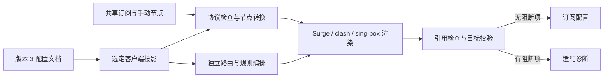

# 2.0 架构与消融审查

## 配置边界

运行配置保存为版本 3 文档。订阅源、手动节点和链式节点共享；`clients.surge`、`clients.clash`、`clients.singbox` 分别拥有 `groups`、`disabledGroups`、`ruleSets.sources`、网络、DNS、路由、规则编排和高级设置。组与来源的名称、ID 和引用均在本端解析。版本 2 按 `groupTargets` 拆分组，来源全量复制并保留引用；Surge 组的 url-test 迁移为 smart。旧共享 hidden 仅保留于 Surge，避免迁移后意外隐藏 clash 分组。读取转换不改写原快照，保存后写入版本 3。

界面、客户端字段与内部 `Target` 统一使用 `clash`；读取旧文档时兼容 `clients.mihomo`，UA 识别继续接受 `mihomo` 别名。所有客户端共享通用订阅地址。Stash 类型只用于读取历史配置，当前目标集合不包含它或 Shadowrocket。

订阅配置统一通过 `/sync/<read_token>/` 获取，基础路径可配置，末尾 `/` 可省略。UA 只用于识别 Surge、clash 或 sing-box 客户端，不用于判断版本、平台或发行渠道。UA 缺失、未知、含多个目标标识或属于已移除客户端时拒绝生成；客户端独立路径、版本 Tag 和旧文件名入口不再接受。Surge 内嵌更新链接始终使用通用地址。规则文件仍通过带格式扩展名的 `/r/` 路径读取，不依赖 UA。

`config-document.ts` 管理持久化结构与兼容投影。`RenderConfig` 仅服务已有渲染器与历史读取，不能直接写入 KV。`config-store.ts` 沿用版本 2 加密快照封装，内部配置文档写入版本 3，并沿用追加版本、读回验证和延迟清理。

## 消融结果

| 候选机制 | 处理 | 原因 |
| --- | --- | --- |
| 全客户端同一组网络/DNS字段 | 移除 | 三端功能与语义不同，独立字段可保留配置而不相互覆盖 |
| 动态插件与适配器注册框架 | 不引入 | 固定三个目标，静态分派已足够 |
| 服务器草稿、发布版本双存储 | 不引入 | 浏览器内存草稿与现有加密快照满足编辑和保存 |
| 新数据库或状态服务 | 不引入 | 沿用 Workers KV、现有 Secrets 和版本化快照 |
| 每端重复抓取相同规则来源 | 合并 | 共享源正文缓存；刷新批次复用抓取结果 |
| 不同端同名规则集共用编译缓存 | 移除 | 改为目标独立命名空间与包含目标的指纹 |
| 自动补 DIRECT / Proxy、替换协议版本或不支持的组类型 | 移除 | 可能改变流量路径或连接协议，应报告并阻断关键问题；用户指定的 Surge `url-test` → `smart` 映射保留，并按输出后的 smart 类型校验成员 |
| sing-box 字段宽松透传 | 增加固定版本校验 | 官方 1.14.0 Schema 检查字段，图检查负责实际引用与循环 |
| Surge 版本/渠道识别与能力档位 | 移除 | Surge 统一按保存的设置输出，不维护版本门槛或裁剪能力 |
| 按 UA 自动分派的通用订阅入口 | 恢复并统一使用 | 三端共用一个地址；UA 仅选择客户端，独立入口和 Tag 均移除 |
| 一次性删除旧配置 | 移除 | 先确认、写入并读回新快照，至少 5 分钟后分批清理 |

## 兼容性与诊断

普通不支持节点或可省略附加功能产生 warning；缺少实际使用的策略、空组、链式依赖、循环、无等价规则和原生字段校验失败产生 error。error 使 `canDownload=false`、生成内容为空，订阅请求返回 422；其他客户端继续使用自己的设置。引用不会自动改写为 Proxy 或 DIRECT。

sing-box 从 Surge 的转换只在旧文档迁移时执行。无等价转换的关键设置记为 `migrationIssues`；管理员可以修改后明确标记已处理。标记仅移除迁移待办，后续 Schema 和引用校验仍执行。

原生 sing-box 节点保留出站字段；向其他格式转换时检查无法保留的认证、TLS 和传输参数。完整客户端 JSON 接受额外原生顶层字段，但 `outbounds` 始终由共享节点与组生成。格式/内核检查不证明设备权限、证书路径或实际网络连通。

## 缓存与迁移

Surge 在客户端投影后直接生成已配置的功能。代理协议、策略组、Tailscale、Host 与脚本保留现有渲染和语义检查，不再按版本或渠道过滤。跨客户端的不支持功能仍由各端适配和诊断处理。详见 [Surge 输出说明](surge-compatibility.md)。

Surge 自动更新 URL 始终使用通用入口。订阅响应设置 `Cache-Control: no-store` 和 `Vary: User-Agent`，复用的仅是原始源与按目标隔离的规则编译缓存。本次订阅地址与 Surge 输出策略调整不改变 KV 数据结构。

来源配置独立，源正文沿用按 URL 计算的共享缓存键。刷新跨端按 URL 去重，诊断按目标筛选；清理时使用所有端仍启用来源的 URL 并集，避免一个端删除其他端的缓存。编译缓存通过请求级 KV 包装映射到 `cache:v2:<target>:compiledRuleSet...`，源键不变；缓存指纹包含目标、编译器修订、来源 URL、启用状态、格式与规则内容。HTTP 缓存版本同时包含指纹与存储版本，避免同名或同时更新造成串用。

读取旧配置只生成内存中的迁移草稿。旧文档指纹基于未经规范化的原始快照；确认请求检查指纹，防止提交过期草稿。配置导出与备份下载已移除，迁移不要求下载确认。新快照经过读回验证后记录提交标记与 KV schema 12，之后禁止回退旧版快照；若快照已写入但提交标记尚未完成，后续读取可补齐。清理沿用宽限期与分批机制，不触及 Secrets、订阅源数据或其他运行资源。

Workers KV 仍具有最终一致性；不同位置短时间读取旧版本或旧 token 属于平台边界，并非强一致提交协议。未增加服务器协作锁或多用户冲突合并。

## 验证方式

按仓库规则使用类型检查、Worker 构建、公开文件扫描、浏览器实际操作与本地 API 请求，不新增或修改测试代码。官方 sing-box 1.14.0 检查完整输出与编译规则源。GitHub 发布、远程 Secrets/KV 修改及线上部署均不属于本次实现验证。
