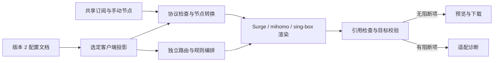

# 2.0 架构与消融审查

## 配置边界

运行配置只保存一个版本 2 文档。订阅源、手动节点、链式出口、策略组及规则来源共享；`clients.surge`、`clients.mihomo`、`clients.singbox` 分别拥有网络、DNS、路由、规则编排和高级设置。共享组的 `groupTargets` 指定适用端。

内部 `Target` 暂保留 `clash` 标识以复用 mihomo 渲染与缓存代码；API 接受 `mihomo` 别名，公开链接使用 `/clash/`。Stash 类型只用于读取历史配置，当前目标集合不包含它或 Shadowrocket。

订阅路由只接受独立客户端路径：`/surge/`（默认正式版）、`/surge/stable/`、`/surge/tf/`、`/clash/`、`/sing-box/`。通用 token 根地址和旧文件名入口已移除；预览 API 也必须提供 `target`。生成器不再读取 UA 推断目标，Surge 内嵌更新链接保留独立路径与 Tag，mihomo 与 sing-box 由客户端保存对应订阅地址用于更新。UA 仅保留在抓取源设置和请求统计中。

`config-document.ts` 管理持久化结构与兼容投影。`RenderConfig` 仅服务已有渲染器与历史读取，不能直接写入 KV。`config-store.ts` 写入加密版本 2 快照，并沿用追加版本、读回验证和延迟清理。

## 消融结果

| 候选机制 | 处理 | 原因 |
| --- | --- | --- |
| 全客户端同一组网络/DNS字段 | 移除 | 三端功能与语义不同，独立字段可保留配置而不相互覆盖 |
| 动态插件与适配器注册框架 | 不引入 | 固定三个目标，静态分派已足够 |
| 服务器草稿、发布版本双存储 | 不引入 | 浏览器内存草稿与现有加密快照满足编辑、预览和保存 |
| 新数据库或状态服务 | 不引入 | 沿用 Workers KV、现有 Secrets 和版本化快照 |
| 每端重复抓取相同规则来源 | 合并 | 共享源正文缓存；刷新批次复用抓取结果 |
| 不同端同名规则集共用编译缓存 | 移除 | 改为目标独立命名空间与包含目标的指纹 |
| 自动补 DIRECT / Proxy、替换组类型或协议版本 | 移除 | 可能改变流量路径或连接协议，应报告并阻断关键问题 |
| sing-box 字段宽松透传 | 增加固定版本校验 | 官方 1.14.0 Schema 检查字段，图检查负责实际引用与循环 |
| 从 Surge UA 推断正式版或 TF 能力 | 移除 | UA 格式与 TF 营销版本不可靠；路径 Tag 选择固定、可审查的能力档位 |
| 按 UA 自动分派的通用订阅入口 | 移除 | 三端使用独立地址，预览与实际订阅显式选择相同目标 |
| 一次性删除旧配置 | 移除 | 先导出、确认、写入并读回新快照，至少 5 分钟后分批清理 |

## 兼容性与诊断

普通不支持节点或可省略附加功能产生 warning；缺少实际使用的策略、空组、链式依赖、循环、无等价规则和原生字段校验失败产生 error。error 使 `canDownload=false`、生成内容为空，订阅请求返回 422；其他客户端继续使用自己的设置。引用不会自动改写为 Proxy 或 DIRECT。

sing-box 从 Surge 的转换只在旧文档迁移时执行。无等价转换的关键设置记为 `migrationIssues`；管理员可以修改后明确标记已处理。标记仅移除迁移待办，后续 Schema 和引用校验仍执行。

原生 sing-box 节点保留出站字段；向其他格式转换时检查无法保留的认证、TLS 和传输参数。完整客户端 JSON 接受额外原生顶层字段，但 `outbounds` 始终由共享节点与组生成。格式/内核检查不证明设备权限、证书路径或实际网络连通。

## 缓存与迁移

Surge 在客户端投影后，按 `/surge/stable/` 或 `/surge/tf/` 的能力表裁剪本次输出，持久化字段保持完整。无 Tag 默认正式版；预览通过 `profile` 参数选择同一个档位。代理协议、可选参数、策略组、Tailscale、Host 与事件脚本统一查表；裁剪后继续检查依赖，不能通过删除链路参数改变流量路径。两平台共用的档位只开启 iOS 与 macOS 基线都支持的功能。详见 [Surge 兼容档位](surge-compatibility.md)。

Surge 自动更新 URL 保留档位。订阅响应不缓存；只复用原始源与规则编译缓存，能力投影在每次生成时进行。本次增加 Tag 无需变更 KV 数据结构。

源正文沿用共享缓存键。编译缓存通过请求级 KV 包装映射到 `cache:v2:<target>:compiledRuleSet...`，源键不变；缓存指纹包含目标、编译器修订、来源 URL、启用状态、格式与规则内容。HTTP 缓存版本同时包含指纹与存储版本，避免同名或同时更新造成串用。

读取旧配置只生成内存中的迁移预览。备份直接解密旧快照，不先规范化；确认请求同时检查备份确认和旧文档指纹。新快照经过读回验证后记录提交标记与 KV schema 12，之后禁止回退旧版快照；若快照已写入但提交标记尚未完成，后续读取可补齐。清理沿用宽限期与分批机制，不触及 Secrets、订阅源数据或其他运行资源。

Workers KV 仍具有最终一致性；不同位置短时间读取旧版本或旧 token 属于平台边界，并非强一致提交协议。未增加服务器协作锁或多用户冲突合并。

## 验证方式

按仓库规则使用类型检查、Worker 构建、公开文件扫描、浏览器实际操作与本地 API 请求，不新增或修改测试代码。官方 sing-box 1.14.0 检查完整输出与编译规则源。GitHub 发布、远程 Secrets/KV 修改及线上部署均不属于本次实现验证。
