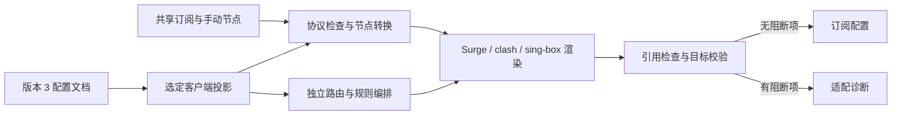

# 架构与设计边界

## 配置边界

运行配置只接受版本 3 文档。订阅源、手动节点和链式节点共享；`clients.surge`、`clients.clash`、`clients.singbox` 分别拥有 `groups`、`disabledGroups`、`ruleSets.sources`、网络、DNS、路由、规则编排和高级设置。组与来源的名称、ID 和引用均在本端解析。

界面、客户端字段与内部 `Target` 统一使用 `clash`，订阅 UA 识别接受当前 Mihomo 客户端。订阅源保存实际请求 UA 字符串，不解析已撤销客户端的预设名。所有客户端共享通用订阅地址。

订阅配置统一通过 `/sync/<read_token>/` 获取，基础路径可配置，末尾 `/` 可省略。UA 只用于识别 Surge、clash 或 sing-box 客户端，不用于判断版本、平台或发行渠道。UA 缺失、未知、含多个目标标识或属于已移除客户端时拒绝生成；客户端独立路径、版本 Tag 和旧文件名入口不再接受。Surge 内嵌更新链接始终使用通用地址。规则文件仍通过带格式扩展名的 `/r/` 路径读取，不依赖 UA。

```mermaid
flowchart LR
  D[版本 3 配置文档] --> P[选定客户端投影]
  S[共享订阅与手动节点] --> N[协议检查与节点转换]
  P --> N
  P --> R[独立路由与规则编排]
  N --> A[Surge / clash / sing-box 渲染]
  R --> A
  A --> V[引用检查与目标校验]
  V -->|无阻断项| O[订阅配置]
  V -->|有阻断项| E[适配诊断]
```

`config-document.ts` 管理持久化结构与客户端投影。`RenderConfig` 仅服务渲染器，持有原始版本 3 文档，不能直接写入 KV。`config-store.ts` 使用版本 2 加密快照封装保存版本 3 文档；封装版本与文档版本相互独立。保存采用追加版本、读回验证和宽限期清理，保留三个配置版本。

只读取当前版本化快照；发现不支持的旧存储时拒绝读取和保存，不回退成默认配置。只有全新存储使用默认值。链式筛选由节点的 `chainFilter` 保存，各客户端资源无需共享分组目标字段。

## 消融结果

| 候选机制 | 处理 | 原因 |
| --- | --- | --- |
| 全客户端同一组网络/DNS字段 | 移除 | 三端功能与语义不同，独立字段可保留配置而不相互覆盖 |
| 跨客户端设置转换、复制与初始化 | 移除 | 三端使用本端设置及默认值，只接受当前文档结构 |
| 动态插件与适配器注册框架 | 不引入 | 固定三个目标，静态分派已足够 |
| 服务器草稿、发布版本双存储 | 不引入 | 浏览器内存草稿与现有加密快照满足编辑和保存 |
| 新数据库或状态服务 | 不引入 | 沿用 Workers KV、现有 Secrets 和版本化快照 |
| 每端重复抓取相同规则来源 | 合并 | 共享源正文缓存；刷新批次复用抓取结果 |
| 不同端同名规则集共用编译缓存 | 移除 | 改为目标独立命名空间与包含目标的指纹 |
| 自动补 DIRECT / Proxy、替换协议版本或不支持的组类型 | 移除 | 可能改变流量路径或连接协议，应报告并阻断关键问题；用户指定的 Surge `url-test` → `smart` 映射保留，并按输出后的 smart 类型校验成员 |
| sing-box 字段宽松透传 | 增加固定版本校验 | 官方 1.15.0-alpha.8 Schema 检查字段，图检查负责实际引用与循环 |
| Surge 版本/渠道识别与能力档位 | 移除 | Surge 统一按保存的设置输出，不维护版本门槛或裁剪能力 |
| 按 UA 自动分派的通用订阅入口 | 恢复并统一使用 | 三端共用一个地址；UA 仅选择客户端，独立入口和 Tag 均移除 |
| 在线旧格式迁移任务 | 不保留 | 旧数据不自动改写；当前快照的传播宽限期与版本清理独立保留 |

## 兼容性与诊断

普通不支持节点或可省略附加功能产生 warning；缺少实际使用的策略、空组、链式依赖、循环、无等价规则和原生字段校验失败产生 error。error 使 `canDownload=false`、生成内容为空，订阅请求返回 422；其他客户端继续使用自己的设置。引用不会自动改写为 Proxy 或 DIRECT。

Surge、Clash 和 sing-box 使用本端原生设置与默认值，不互相转换或复制。sing-box 配置固定校验 `1.15.0-alpha.8`，不自动替换旧内核版本。Clash 本端原生规则转规则编排是当前编辑功能，转换后仍校验规则与来源引用。

原生 sing-box 节点保留出站字段；向其他格式转换时检查无法保留的认证、TLS 和传输参数。完整客户端 JSON 接受额外原生顶层字段，但 `outbounds` 始终由共享节点与组生成。格式/内核检查不证明设备权限、证书路径或实际网络连通。

## 缓存与持久化

Surge 在客户端投影后直接生成已配置的功能。代理协议、策略组、Tailscale、Host 与脚本保留现有渲染和语义检查，不再按版本或渠道过滤。跨客户端的不支持功能仍由各端适配和诊断处理。详见 [Surge 输出说明](surge-compatibility.md)。

Surge 自动更新 URL 始终使用通用入口。订阅响应设置 `Cache-Control: no-store` 和 `Vary: User-Agent`，复用的仅是原始源与按目标隔离的规则编译缓存。

来源配置独立，源正文沿用按 URL 计算的共享缓存键。刷新跨端按 URL 去重，诊断按目标筛选；清理时使用所有端仍启用来源的 URL 并集，避免一个端删除其他端的缓存。编译缓存通过请求级 KV 包装映射到 `cache:v2:<target>:compiledRuleSet...`，源键不变；缓存指纹包含目标、编译器修订、来源 URL、启用状态、格式与规则内容。HTTP 缓存版本同时包含指纹与存储版本，避免同名或同时更新造成串用。

Worker 与 Actions 都按 `planRuleSetArtifacts` 选择最终产物，Worker 的发布可见性检查也使用同一计划，并包含需要的 DNS 文件。内存分桶用于编译，计划之外的中间分桶不写入 KV。Clash 的跨条目聚合分支已删除，Surge 的按策略聚合继续保留。版本元数据回退仍用于处理 head 索引写入失败。

来源缓存只接受当前加密正文与独立元数据；旧明文正文或共享索引视为缓存缺失，重新抓取生成。编译缓存只读取带存储版本的产物，保留 head 写入失败后的版本元数据恢复路径。Actions 集成只读取当前凭据与回调地址，不运行旧键搬迁或清理状态机；统计只读取独立拉取记录。

Workers KV 仍具有最终一致性；不同位置短时间读取旧版本或旧 token 属于平台边界，并非强一致提交协议。未增加服务器协作锁或多用户冲突合并。

## 验证方式

按仓库规则使用类型检查、Worker 构建、公开文件扫描、浏览器实际操作与本地 API 请求，不新增或修改测试代码。官方 sing-box 1.15.0-alpha.8 检查完整输出与编译规则源。GitHub 发布、远程 Secrets/KV 修改及线上部署均不属于本次实现验证。
